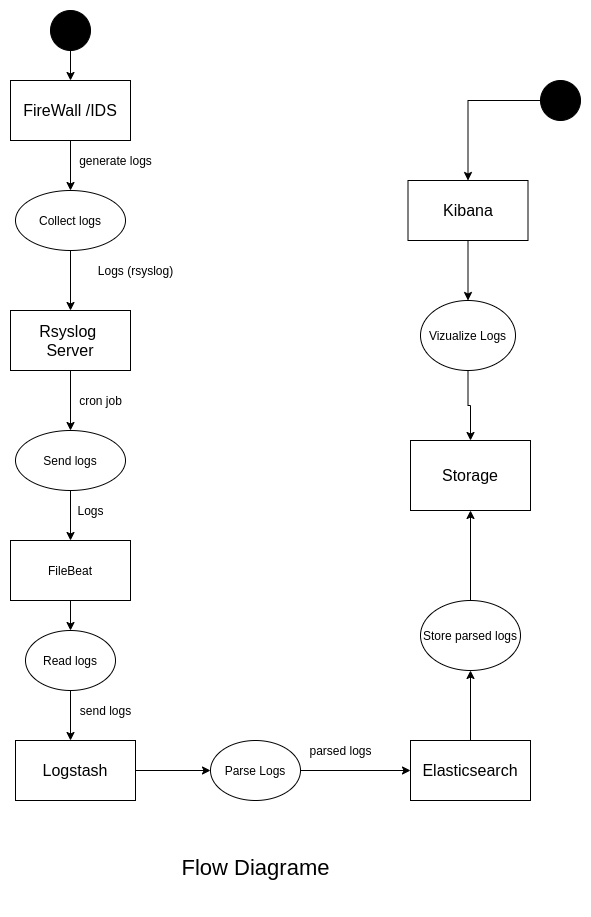
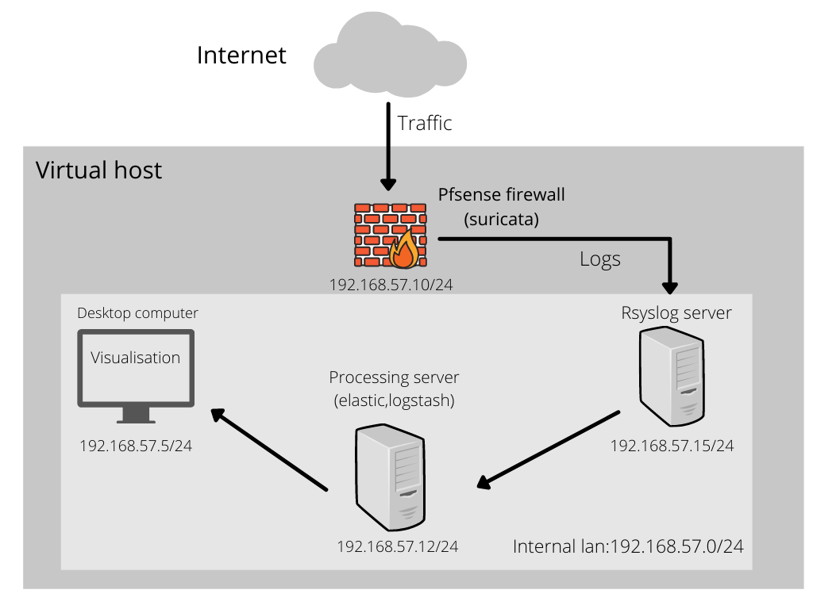
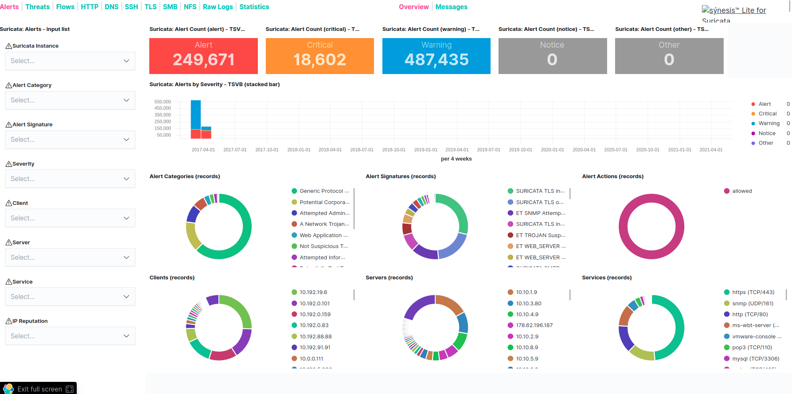
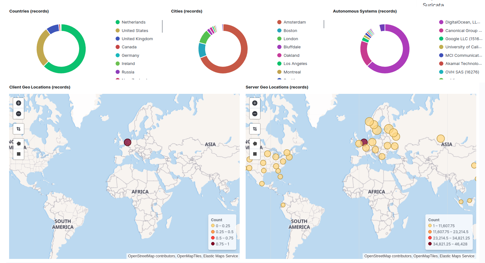
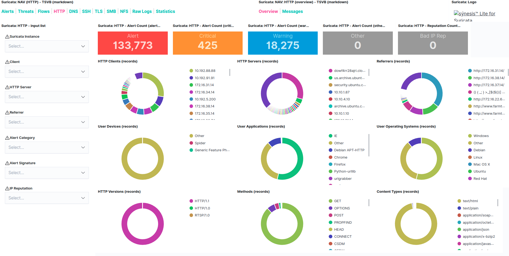

This repo contains my bachelor's degree final year project.
It was about deploying a system for visualization of network attacks using the elastic stack.

## **Technologies used**
    + Ansible: For task automation on the servers.
    + Docker for deploying the elastic stack.
    + Pfsense firewall.
    + Suricata IDS.
  

  

### Flow diagram

## Virtual host

## Screenshots

## Refrences

- synlite_suricata https://github.com/robcowart/synesis_lite_suricata
